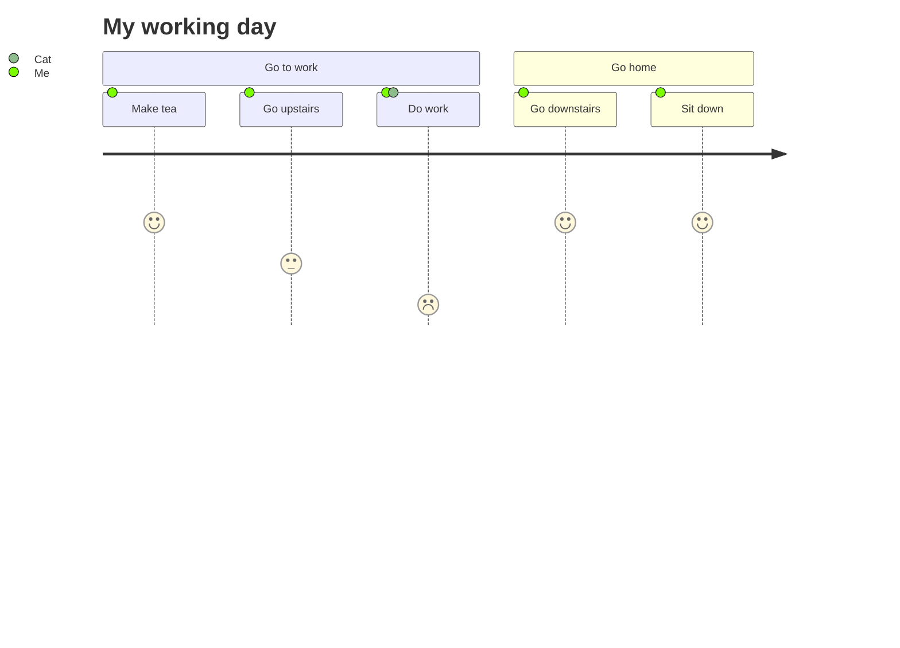

最近看paper的时候，总觉得看多了之后好像知道了些东西，也好像又没知道些什么东西。总是听别人说，要多落实到笔头，以前也一直有搞一个博客玩玩的想法，最近稍微研究了一下，发现弄个博客真的很简单，甚至本地都不用配置环境，直接无脑把starter模板下下来就行，还是很方便的。

接下来，不免俗的，稍微测试一下博客本身支持的特性。

# 标题

---

# 这是一级标题

## 这是二级标题

### 这是三级标题

#### 这是四级标题

##### 这是五级标题

###### 这是六级标题

---


# 分段

段落1

段落2

段落3


# 列表

## 有序列表

1. 首先
2. 其次
3. 最后

## 无序列表

* 章
  * 节
    * 段

# 任务列表

* [ ] TODOs
* [X] Completed
* [ ] Music Learning
  * [X] Rhythm
  * [X] Melody
  * [ ] Techiques

# 定义列表

名词1

: 解释1

名词2

: 解释2

# 引用文字

> 引用文字示例

# 表格

| A            | B      | C       |
|:-------------|:------:|--------:|
| 123          | AAA    | 87.99   |
| 345          | BBB    | 78.54   |
| 567          | CCC    | 95.52   |

# 链接与超链接

<http://127.0.0.1:8080>

[超链接示例](https://www.example.com/)

# 脚注

这段文字后是脚注1[^fn1]，而后跟随下一个脚注[^fn2]

# 图片

## 官方示例
做个记录，格式支持很全

- Default (with caption)

{: width="972" height="589" }
_Full screen width and center alignment_

<br>

- Shadow

{: .shadow width="1548" height="864" style="max-width: 90%" }
_shadow effect (visible in light mode)_

<br>

- Left aligned

{: width="972" height="589" style="max-width: 70%" .normal}

<br>

- Float to left

  {: width="972" height="589" style="max-width: 200px" .left}
  "A repetitive and meaningless text is used to fill the space. A repetitive and meaningless text is used to fill the space. A repetitive and meaningless text is used to fill the space. A repetitive and meaningless text is used to fill the space. A repetitive and meaningless text is used to fill the space. A repetitive and meaningless text is used to fill the space. A repetitive and meaningless text is used to fill the space. A repetitive and meaningless text is used to fill the space. A repetitive and meaningless text is used to fill the space. A repetitive and meaningless text is used to fill the space. A repetitive and meaningless text is used to fill the space. A repetitive and meaningless text is used to fill the space."

<br>

- Float to right

  {: width="972" height="589" style="max-width: 200px" .right}
  "A repetitive and meaningless text is used to fill the space. A repetitive and meaningless text is used to fill the space. A repetitive and meaningless text is used to fill the space. A repetitive and meaningless text is used to fill the space. A repetitive and meaningless text is used to fill the space. A repetitive and meaningless text is used to fill the space. A repetitive and meaningless text is used to fill the space. A repetitive and meaningless text is used to fill the space. A repetitive and meaningless text is used to fill the space. A repetitive and meaningless text is used to fill the space. A repetitive and meaningless text is used to fill the space. A repetitive and meaningless text is used to fill the space."

<br>

## 图床测试


_这是图片的居中标题_
<br>

# Mermaid流程图

# 数学公式

$$
e^{i \pi} + 1 = 0
$$

# 行内代码

行内的代码`code`

# 代码块

```c++
#include <iostream>

using namespace std;

int main()
{
  cout << "Hello, World!" << endl;
  return 0;
}
```

# 内嵌视频



# 逆向脚注（引用）

[^fn1]: The footnote source
[^fn2]: The 2nd footnote source

